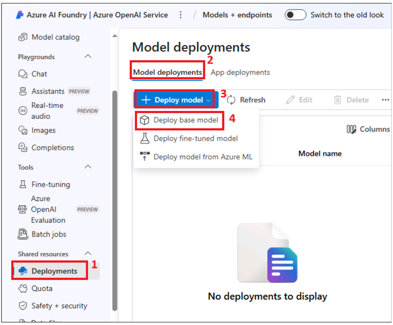

### **Lab 04 - Integrating Azure OpenAI service and AI service for Customer Engagement**

**In this lab you will learn how-to:**

- Use AI-based recommendation systems for prediction
- Using insights from the enhanced segmentation
- Use Azure AI Search Services to enrich the chatbot with search

>**Introduction:** In this task, we will integrate the Azure OpenAI chatbot into Contoso Bank’s customer engagement platforms. The chatbot will serve as an interactive tool for customers, helping them explore loan products, get personalized loan recommendations, and receive real-time assistance. We will use Azure OpenAI’s natural language processing capabilities to ensure the chatbot delivers a smooth, human-like experience while collecting valuable customer data for further analysis.

### **Task 1 : Set Up Azure AI Search service**

In this task, we create Azure AI Search service for enriching the chatbot with search and query capabilities based on customer data and loan details.

1.  Switch back to Azure portal and search for `Azure AI search` and select it.

    

2.  Click on **Create**.

    

3.  Select below values and then click on **Review + Create**.

    - Subscription : Your Azure subscription.

    - Resource group - Select your existing resource group

    - Service name - `cbsb-aisearchXXXX` ( replace XXXX with unique number)

    - Location : **west us**/north Europe /location near to you

    

4.  Click on **Create** now.

    

5.  Wait for the deployment and then click on **Go to resource**.

    

6.  Open a Notepad and make a note of URL value as  **AZURE_SEARCH_ENDPOINT**. We will use it later to communicate to the service.

    

7.  Navigate to the **Keys** section (exapnd **Settings**). Copy the API Key (Primary admin key) and save it as **AZURE_SEARCH_KEY** in your notepad. You will need this later to communicate with the service.

    

### **Task 2 : Create Azure AI multi-service resource**

In this task, we will create an AI multi-service resource for NLP to enrich data and interact with customers through the chat app.

1.  Follow the steps below to create an Azure AI multi-service resource in the **same region (location) as that of your Azure search service**.

2.  Open a new tab in a browser and go to  `https://portal.azure.com/#create/Microsoft.CognitiveServicesAllInOne`
    Sign in with your Azure subscription account

3.  Enter below values and then click on **Review + create**.

    - Subscription : Your Azure subscription

    - Resource group : Your existing resource group which was created in Lab 1

    - Region : **Same region as your Search service region**

    - Name : `cbsb-aimultiserviceXXXX` (XXXX can be unique number)

    - Price tier : **Standard S0**

    - Select **By checking this box I acknowledge that I have read and understood all the terms below** check box.

    

    

4.  Review the details and click on **Create**.

    

5.  Wait for the deployment to be completed. Deployment takes 1-2 min.
    Click on **Go to resource** button.

    

### **Task 3 : Create Azure OpenAI resource**

In this task, we will create Azure OpenAI resource to deploy OpenAI models for embeddings and completions to use them in our Chat app

1.  Navigate to Azure Portal in a new tab and search for `Azure OpenAI` service and select it.

    

2.  Click on **Create** button in the top menu.

    

3.  Enter below details and click on

    - Subscription : Azure subscription

    - Resource group -  your Azure resource group

    - Region : **East US**

    - Name -  `cbazopenaiXXXX` (XXXX can be unique number)

    - Price tier -**Standard S0**

    

4.  Click on **Next- > Next- > Create** slelecting the default settings.

    

    

    

5.  Once the deployment completes, click on **Go to resource**.

    

6.  Expand Resource management from left navigation ,click on **Keys and  Endpoint**. Copy URL in the **Endpoint** field and save in your notepad as **AZURE_OPENAI_ENDPOINT**.
    Copy the **Key 1** value and save as **AZURE_OPENAI_KEY**. 

    

7.  Click on **Overview** tab on the left navigation panel, and then click on **Go to Azure OpenAI Studio**. Azure OpenAI Studio opens in new tab.
    
    

8.  **Azure AI Foundry|Azure OpenAI Service** page opens.Sign in if required and close the pop-ups that appear.

    

9.  Click on **Deployment**  under **Shared resources** from left navigation menu. In the **Deploy model** drop down menu select **Deploy base model.**

    

10. Search for `gpt-35-turbo-16k` and select it. Click on **Confirm**. GPT-3.5 models can understand and generate natural language or code. GPT-3.5 Turbo is the most capable and cost effective model in the GPT-3.5 family, which has been optimized for chat and works well for traditional completions tasks as well.

    

11. In the deployment dialogbox, click on **Customize** button

    

12. Set **Tokens per Minute Rate limit** to max and then click on **Deploy**.

    

13. Repeat above steps and deploy `text-embedding-ada-002` model as well. Text-embedding-ada-002 outperforms all the earlier embedding models on text search, code search, and sentence similarity tasks and gets comparable performance on text classification. Embeddings are numerical representations of concepts converted to number sequences, which make it easy for computers to understand the relationships between those concepts.

    

    

14. Set maximum **Tokens per Minute Rate Limit** and then click on **Deploy.**

    

    

### **Task 4: Create skillsets in Azure AI search**

In this task, we will create a skillset  object in Azure AI Search that's attached to an indexer.It contains one or more skills that call built-in AI or external custom processing over documents retrieved from an external data source. Creating and mappink the skills will enhance the in saerch we perform on the index.

1. On the **Identity** page of your Azure AI search service, turn on **System assigned** Managed Identity. Click **Save** on the top menu to generate the Object ID of the managed identity.

    

2. Click on **yes**

    

3. Copy the **Object ID** of the managed identity created, and click on **Azure Role Assignments** button to assign the required permissions to this ID.

    

4. Click on **Add role assignments (Preview)** on the top menu.(Note : ignore the error **Unable to list classic administrators because a server error occurred. Please try again later.** . proceed and assign role)

    

5. Select below values.

    - In the **Scope** drop down, select **Storage**.
    - In the **Resource** drop down, select your storage account.
    - Search and assign the `Storage Blob Data Reader` role to this Managed Identity on your Azure storage.

    

6. Click on **Save** now.

    

    

7. On the **Overview** page of your Azure Search service, click
on **Import and vectorize data** from the top menu.

    

8. Select **Azure Blob Storage** tile.

    

9. Enter below values and then click **Next**.

    **Subscription : Your Azure Subscription**

    **Storage account : Your storage account**

    **Blob container : azureml-blobstore-XXXXX**

    

10. Select below values and then click on **Next**.

    Kind: **Azure OpenAI**

    Subscription : **Your Azure subscription**

    Azure OpenAI service : **select Azure OpenAI service**

    Model deployment : **text-embedding-ada-002**

    Select check box : I acknowledge that connecting to an Azure OpenAI
    service will incur additional costs to my account.

    

11. without selecting anything, click on **Next**.

    

12. Click on **Next**.

    

13. Enter **Objects name prefix** : +++customer-index+++ and
then click **Create**.

    

14. Click on **Close** .

    

15. Select **Indexes** under **Search management**, wait for the
**Document count** and **Vector index size** gets updated. It takes a
few minutes to get update.

    

16. Click on Index name .

    

17. Click on **Fields tab -> Add field**. Enter below values and then
click on **Save**.

    Field name : +++**CustomerID**+++

    Type : Edm.String

    Configure attributes : **Select All**

    

18. Repeat the above step to also add the below fields.

- Field name –`Name`, Type - Edm.String , Skills -All

- Field name -`Age`, Type - Edm.Double , Skills -All

- Field name -`CustomerSince`, Type - Edm.Double , Skills -All

- Field name -`HighestSpend`, Type - Edm.Double , Skills -All

- Field name -`MonthlyAverageSpend`, Type - Edm.Double , Skills
  -All

- Field name – `AccountType`, Type - Edm.String , Skills -All

- Field name – `Balance`, Type - Edm.Double, Skills -All

- Field name -`LoanAmount`, Type - Edm.Double , Skills -All

- Field name -`Income`, Type - Edm.Double , Skills -All

- Field name -`campaignresult`, Type - Edm.String , Skills -All

    

19. Click on **Save** button to save the new fields and click on Search
service name on top navigation menu.

    

### **Task 5: Build and Deploy Chat app in Azure AI Foundry.**

In this task, we will create, configure, and deploy the chatbot powered by Azure AI, integrated with our AML model.

1.  Open a new tab, navigate to `https://ai.azure.com` and sign in with your assigned Azure account.

    

2. In **Azure AI Foundry** page ,click on **Create project**.

    

3. Enter the Project name: `cbsbaoai-proj` and then click on Customize button.

    

4.  Enter the below values and then click on **Next**

    - Hub name: `cbcbaoaihub`

    - Subscription: Your Azure subscription

    - Resource group - your existing resource group

    - Location -same location (region) as your Azure Open AI service region

    - Connect Azure AI Services or Azure OpenAI: Select your Azure OpenAI service

    - Connect Azure AI Search: Select your Azure AI Search

    

5. Click on **Create** button.

    

6. Close the experiment pop up window.

    

7. Click on **Playgrounds** from the left navigation menu, select **Try
    the Chat playground**

    

8.  In Setup section in the details pane, expand **Add your
    data** and then click on **Add a new data source**.

    

9. Select **Azure AI Search** as **Data source** and then
    click **Next**.

    

10. Select your **Azure AI Search** service from the drop-down menu,
    and then select **customer-index** that you created previously, and then
    click **Next**.

    

11. In the **Configure search settings**, keep the default value
    (customer-index), click **Next**.

    

12. In the **Vector Index**, keep the default value (customer-index),
    click **Next**.

    

13. Click on **Create Vector Index**.

    

14. Enter the below prompt in the **Type user query here** text box and
    press the send button.

    +++Show only high-value customers along with their name, age, and campaign
    result+++

    

15. Once response is received, enter the below prompt next and press send

    +++list customer name, age ,campaignresult of Medium Value Customer+++

    

    +++Show only customers with Business account along with their name, age,
    and Account Type.+++

    

16. Now, you are ready to deploy your app. Click on **Deploy- > as a
    web app** from the top menu.

    

17. Enter the below details and then click on **Deploy**. Deployment
    takes 5-10 min to complete.

    - Select **Create a new web app** radio button

    >Note : Deployment takes 5-10 minutes

    - Name: should be a unique name (eg `mlappchatappXXXX` - XXXX can be a
    unique number)

    - Subscription: Your Azure subscription

    - Resource group - your resource existing resource group

    - Location - West US / Central US / East US/East US 2 ( usually East US has high
  demand and deployment may fail). You can use the same location as the
  hub

    - Pricing plan: Standard (S1) /S2

    - Enable chat history in the web app : select check box.

    

    

18. Switch back to Azure portal page, click on **Resource group -> Resource group** name. Click on **Deployments** under **SEttings** from left navigation menu.

    

19.  Deployment takes 5–10 minutes. You can continue with the next 12 steps in the following lab. The app will be accessible only after the deployment is successful.

>**Summary:** We have successfully integrated the Azure OpenAI chatbot into Contoso Bank’s customer engagement platform. The chatbot provides real-time assistance to potential borrowers, enhancing digital engagement and improving the customer experience. This integration allows the bank to deliver personalized recommendations based on customer behavior and preferences, further supporting targeted marketing efforts.

